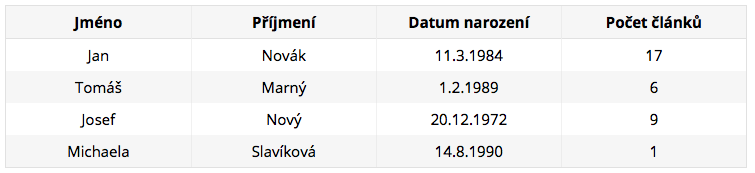
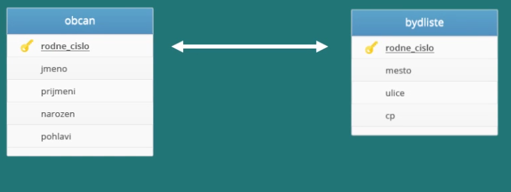
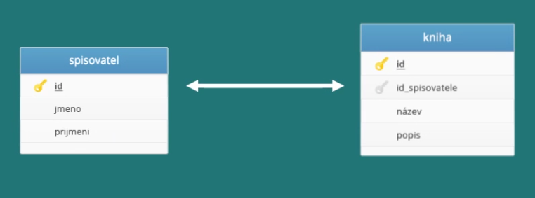
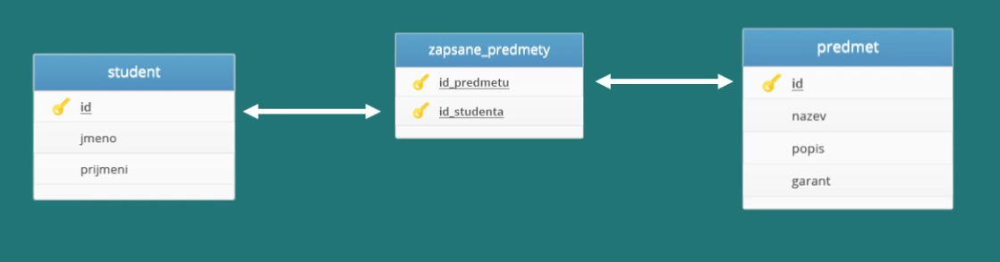

# Uvod do databazi

## Co to je databaze?
* Misto pro ukladani dat 
* Odborne databaze stavi na dvou pojmech SRBD(System rizeni baze dat), ktery definuje jak pracovat s daty, a DB(Baze dat) predstavujici data samotna
* Nejcasteji pouzivane databaze jsou relacni databaze
* Databazove systemy: MySql, MS SQL server, Oracle
* Vsechny relacni databaze maji spolecne, ze pro vyhledavani a praci s daty pouzivaji jazyk SQL
* Prikladem muze byt kartoteka ve ktere jsou data ulozena pomoci urciteho systemu nejcasteji podle jmena data narozeni


## Relacni databaze
Relacni databáze je založena na tabulkách. Každá tabulka obsahuje položky jednoho typu. Můžeme mít tedy tabulku uzivatele, další tabulku clanky a další třeba komentare.
Databázovou tabulku si můžeme představit třeba jako tabulku v Excelu. Tabulka uzivatele by mohla vypadat asi takto:

<div align="center">
      
</div>
  
Položky (konkrétně zde uživatelé) ukládáme na jednotlivé řádky, sloupce pak označují atributy (vlastnosti, chcete-li), které položky mají. MS-SQL databáze je typovaná, to znamená, že každý sloupec má pevně stanovený datový typ (číslo, znak, krátký text, dlouhý text...) a může obsahovat hodnoty jen tohoto typu. Pokud chceme s relační databází rozumně pracovat, každý řádek v tabulce by měl být opatřený unikátním identifikátorem. U uživatelů by to mohlo být třeba rodné číslo, mnohem častěji se však používají identifikátory umělé a to tak, že uživatele prostě očíslujeme. K tomu se dostaneme později.

Slovo relační označuje vztah (anglicky relation). Ten je mezi tabulkami nebo mezi entitami v jedné tabulce. To si ale necháme na jindy a zatím budeme pracovat jen s jednou tabulkou zároveň.

**V bodech**
* Zakladem relacni databaze je tabulka ve ktere jsou ulozena data
* Tabulek muze byt v databazi nekolik a tyto tabulky mohou byt na sobe urcitym zpusobem zavisle -> existuje mezi nimi vazba (relace)
* Kazda tabulka se sklada ze sloupcu a radku 

## Zakladni pojmy relacnich databazi
**Tabulka**
* Zakladni databazovy objekt, ktery slouzi k ukladani dat do pametoveho prostoru relacni databaze.
* Databázovou tabulku si lze představit jako běžnou dvourozměrnou tabulku, která má pevně daný počet a význam jednotlivých položek, které tvoří sloupce tabulky.
  

**Sloupec**
* Sloupce predstavuji atributy napr. jmeno, prijmeni, mesto..
* Kazdy sloupec ma definovany urcity datovy typ (cislo, text, datum, logicka hodnota) a integritni omezeni (musi byt vyplnen, pouze kladne cisla, atd.)

**Radek**
* Reprezentuje jeden zaznam v tabulce
* Napriklad v tabulce Uzivatele predstavuje jeden radek jednoho uzivatele

**Primarni klic**
* Jednoznacny identifikator zaznamu(radku v tabulce)
* Muze se jednat o jeden sloupec nebo kombinaci nekolika sloupcu (slozeny klic)
* Umely klic: pridany dalsi atribut id do tabulky, ktery identifikuje jednotlive radky, pri pridavani novych zaznamu se automaticky inkrementuje na vyssi hodnotu


**Cizi klic**
* Identifikator zaznamu v druhe tabulce
* Slouzi pro vytvareni vztahu mezi tabulkami, umozni nam identifikovat ktere zaznamy patri k datemu klici v druhe tabulce


**Index**
* Databázové indexy slouží ke zrychlení přístupu k datům a měly by se používat u všech sloupců, podle kterých se vyhledává, třídí nebo podle kterých se spojují tabulky.
* Při ukládání dat do tabulek nejsou záznamy obvykle nijak tříděny a ukládají se většinou za sebe tak, jak byly postupně vloženy.
* Index umoznuje rychlejsi vyhledavani, diky serazeni dat do stromove struktury.

## Vazby mezi tabulkami

**Co je to relace?**
* Nektere tabulky mohou byt na sobe zavisle, existuje mezi nimi urcita vazba, ktere se rika relace.
* Prikladem muze byt tabulka Kontakty, ktera je zavisla na tabulce Uzivatele.
* V relacnich databazich mame tri druhy relaci.

**Relace 1:1**
* Relace kdy jeden zaznam odpovida prave jednomu zaznamu z jine databazove tabulky
* Nejjednodusi relace
* Vyuziti zprehledneni rozsahlych tabulek

<div align="center">
    
</div>

**Relace 1:n**
* Relace prirazuje jednomu zaznamu vice zaznamu z jine tabulky
* Jednu tabulku tak propojime pomoci ciziho s primarnim klicem druhe tabulky
* Nejpouzivanejsi typ relace

<div align="center">
    
</div><br>

**Relace m:n**
* Relace se pouziva mezi dvema tabulkami kde vice zaznamu z jedne tabulky muze odpovidat vice zaznamum z tabulky druhe.
* Slozitejsi relace, pro jeji provedeni je treba zavest novou tabulku (vazebni).
* Pres vazebni tabulku tabulky propojime a vytvorime relaci m:n.

<div align="center">
    
</div>

## Zakladni datove typy
**K cemu slouzi?**
* Kazdy sloupec v tabulce ma datovy typ, ten definuje jaka data muzeme do tohoto sloupce ukladat.


**Ciselne datove typy**
* INT - bezna cela cisla
* BIGINT - velka cela cisla
* FLOAT - mala cisla vv pohyblive radove carce
* DOUBLE - velka cisla v pohyblive radove carce


Poznamka: Kazdy vyse zmineny datovy typ ma definovany rozsah, ktery zalezi na implementaci databaze.
Poznamka: Pokud nepotrebujeme zaporne hodnoty muzeme pouzit datovy typ UNSIGNED jenz zamezi pouzivani zapornych hodnot a u celocislelnych typu zdvojnasobi rozsah kladnych hodnot.


**Retezcove datove typy**
* CHAR - retezec pevne dane delky do 255 znaku
* VARCHAR - retezec promenne delky do 255 znaku
* TEXT - retezec schopny ulozit dlouhy text vetsi nez 255 znaku

**Datum a cas**
* DATE - slouzi pro ulozeni datumu ve formatu YYYY-MM-DD
* TIME - cas ve formatu hh:mm:ss
* DATETIME - datum s casem ve formatu YYYY-MM-DD hh:mm:ss

**Hodnota NULL**
* Jestlize se ve sloupci zaznamu nachazi hodnota NULL, znamena to, ze v nem nic neni
* Tato hodnota znamena nezadano nebo neznamo

## Normalizace relacnich databazi
**Co to je?**
* Postup popisujici jak spravne navrhnout a vytvorit strukturu databaze
* Databaze by mela vyhovovat tzv. normalnim formam
* Normalni formy urcuji jak navrhnout tabulky, tak aby nedoslo k duplicitam a nekonzistentnim datum
* Existuje nekolik normalnich forem, bezne se  vyzaduje dodrzeni prvnich tri

**Prvni normalni forma**: Tabulka je v pvni normalni forme, pokud kazdy jeji atribut obsahuje jen atomicke hodnoty


**Druha normalni forma**: Tabulka je v druhe normalni forme, pokud splnuje podminky prvni normalni formy kazdy neklicovy atribut je plne zavisly na celem primarnim klici (nejen na jeho casti)

**Treti normalni forma**: Tabulka se nachazi ve treti normalni forme, splnuje-li predchozi dve normalni formy a vsechny neklicove atributy jsou vzajemne nezavisle


## Jazyk SQL
**Co to je?**
* Dotazovaci jazyk urceny pro praci s daty v relacnich databazich
* V prekladu z anglictiny Structured Query Language
* Jinak receno je to jazyk umoznujici komunikovat s databazi jednoduchou anglictinou

**Okenko do historie**

V 70. letech 20. století probíhal ve firmě IBM výzkum relačních databází. Bylo nutné vytvořit sadu příkazů pro ovládání těchto databází. Vznikl tak jazyk SEQUEL (Structured English Query Language). Cílem bylo vytvořit jazyk, ve kterém by se příkazy tvořily syntakticky co nejblíže přirozenému jazyku (angličtině).

K vývoji jazyka se přidaly další firmy. V r. 1979 uvedla na trh firma Relational Software, Inc. (dnešní Oracle Corporation) svoji relační databázovou platformu Oracle Database. IBM uvedla v roce 1981 nový systém SQL/DS a v roce 1983 systém DB2. Dalšími systémy byly např. Progres, Informix[1] a SyBase. Ve všech těchto systémech se používala varianta jazyka SEQUEL, který byl přejmenován na SQL.

Relační databáze byly stále významnější, a bylo nutné jejich jazyk standardizovat. Americký institut ANSI původně chtěl vydat jako standard zcela nový jazyk RDL. SQL se však prosadil jako de facto standard a ANSI založil nový standard na tomto jazyku. Tento standard bývá označován jako SQL-86 podle roku, kdy byl přijat.

V dalších letech se ukázalo, že SQL-86 obsahuje některé nedostatky a naopak v něm nejsou obsaženy některé důležité prvky týkající se hlavně integrity databáze. V roce 1992 byl proto přijat nový standard SQL-92 (někdy se uvádí jen SQL2). Zatím nejnovějším standardem je SQL3 (SQL-99), který reaguje na potřeby nejmodernějších databází s objektovými prvky.

Standardy podporuje prakticky každá relační databáze, ale obvykle nejsou implementovány vždy všechny požadavky normy. A naopak, každá z nich obsahuje prvky a konstrukce, které nejsou ve standardech obsaženy. Přenositelnost SQL dotazů mezi jednotlivými databázemi je proto omezená.


** Prikazy pro definici dat**
```SQL
-- Vytvoreni tabulky
	CREATE TABLE [dbo].[Uzivatele]
	(
	    [Id] INT NOT NULL PRIMARY KEY IDENTITY,
	    [Jmeno] NVARCHAR(60) NOT NULL,
	    [Prijmeni] NVARCHAR(60) NOT NULL,
	    [DatumNarozeni] DATE NOT NULL,
	    [PocetClanku] INT NOT NULL
	)

-- Smazani tabulky
DROP TABLE [dbo].[Uzivatele]
```

**Prikazy pro vkladani a mazani dat v tabulce**
```SQL
-- Vlozeni zaznamu do tabulky
	INSERT INTO [Uzivatele] (
	        [Jmeno],
	        [Prijmeni],
	        [DatumNarozeni],
	        [PocetClanku])
	VALUES (
	'Jan', 'Novák', '1984-11-03', 17
	);

-- Vymazani zaznamu
  DELETE FROM [Uzivatele] WHERE [Id] = 2;

-- Editace zaznamu
	UPDATE [Uzivatele] 
	SET [Prijmeni] = 'Dolejší', 
		[PocetClanku] = [PocetClanku] + 1 
	WHERE [Id] = 1;
```

**Dotazy nad tabulkou**
```SQL
-- Vypsání komentářů napsaných v druhém kvartálu roku 2012, seřazených podle data
	SELECT Obsah,Datum
	FROM Komentar
	WHERE Datum BETWEEN '2012-3-1' AND '2012-6-30'
	ORDER BY Datum;

-- Výpis uživatelů, jejichž přezdívka začíná na určité písmeno (využívá se na webu pro procházení uživatelů
	SELECT Nick, UzivatelID 
	FROM Uzivatel
	WHERE Nick LIKE 'D%';

-- Zjistěte, kolik uživatelů má email se Seznamu
	SELECT COUNT(*) Vysledek
	FROM Uzivatel
	WHERE Email LIKE '%@seznam.cz';

-- Přejmenování sekce (sekce jsou často přejmenovávány z důvodu SEO optimalizace), u přejmenování jsou parametry starý název a nový název
	UPDATE Sekce
	SET Nazev = ('České hry')
	WHERE Nazev = 'Hry';

-- Zjistit celkové body (součet jednotlivých score) výsledků testů od určitého uživatele, podle jeho ID
	SELECT SUM(Skore) Vysledek
	FROM VysledekTestu
	WHERE UzivatelID = 2;

-- Vypsání nejnovějšího článku včetně nicku autora do widgetu na titulní stránce
	SELECT 	TOP 1
        	c.Perex,
        	c.PrettyURL,
        	c.Titulek,
        	c.Publikovano,
        	u.Nick
	FROM Clanek c, Uzivatel u
	WHERE (u.UzivatelID = c.AutorID)
	ORDER BY c.Publikovano DESC;

-- Vypsání článku a přezdívky autora podle URI článku
	SELECT 	c.Perex,
        	c.PrettyURL,
        	c.Keywords,
        	c.Titulek,
        	c.Obsah,
        	c.Publikovano,
        	u.Nick
	FROM Clanek c, Uzivatel u
	WHERE ((c.PrettyURL = 'co-je-to-algoritmus')
        AND (c.AutorID = u.UzivatelID));

-- Vypsání článků v určité sekci podle názvu sekce
	SELECT
        	Clanek.PrettyURL,
        	Clanek.Titulek
	FROM 	Clanek, ClanekSekce, Sekce
	WHERE
    		(ClanekSekce.ClanekID = Clanek.ClanekID) AND
     		(ClanekSekce.SekceID = Sekce.SekceID) AND
        	(Sekce.Nazev = 'Algoritmy');

-- Vypsání prvních 15ti komentářů k danému článku, seřazených od nejnovějších po nejstarší podle URI článku a to včetně nicku uživatele, který komentář napsal.
	SELECT TOP 15
        	k.Obsah,
        	k.Datum,
        	c.PrettyURL,
        	u.Nick
	FROM Komentar k
        JOIN Clanek c
                ON (c.ClanekID = k.ClanekID)
        JOIN Uzivatel u
                ON (k.UzivatelID = u.UzivatelID)
	WHERE (c.PrettyURL = 'cheese-mouse-oddechova-plosinovka')
	ORDER BY k.Datum DESC;
```

------------------------------
**Reference**
* [Kurz relačních databází - Distancne.cz](https://www.distancne.cz/kurz/relacni-databaze-a-dotazovaci-jazyk-sql)
* [SQL Tutorial- w3schools.com](https://www.w3schools.com/sql/)
* [SQL v příkladech - itnetwork.cz](https://www.itnetwork.cz/csharp/databaze/ms-sql-databaze-dotazy-v-prikladech)
* [Relační databáze - Wikipedie.cz](https://cs.wikipedia.org/wiki/Relačn%C3%AD_databáze)
* [Využití databázových indexů - Root.cz](https://www.root.cz/clanky/vyuziti-databazovych-indexu/)